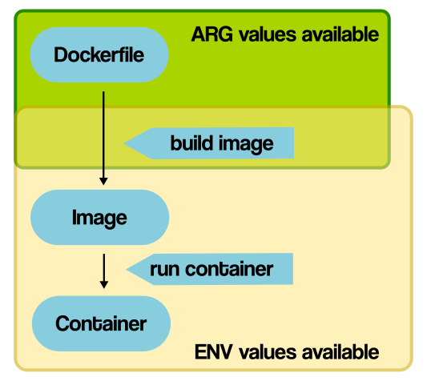

##  Dockerfile reference

### What is dockerfile?
- Docker file is text document file which contains sequential series of commands to build an image
- The commands which user could call on command line
- These commands executed in the order in which they have written
- All these commands get executed on the base image
- Docker file must begin with `FROM` instruction/command


### Dockerfile components
- **FROM**
  - The FROM instruction initiated setup new base image to execute subsequent instructions
  - The valid Dockerfile must begin with `FROM` instruction
  - _Syntax_: `FROM <image_name>:<version>`
- **CMD**
  - The `CMD` commands defines default command to run when container starts
  - Sets default parameters that can be overridden from the Docker Command Line Interface (CLI) when a container is running
  - Syntax: `CMD <command>`  e.g: `CMD python app.py`
- **RUN**
  - The `RUN` command allows to install application and the required packages for it
  - It executes any command(Shell commands) on top of base image and creates new layer giving the result
  - _Syntax:_ `RUN <comomand>` e.g: `RUN pip install -r requirements.txt`
- **ENTRYPOINT**
  - The `ENTRYPOINT` is same as `CMD`
  - The difference is `ENTRYPOINT` allows to give extra argument to given command
  - Default parameters that cannot be overridden when Docker Containers run with CLI parameters
  - _Syntax_: `ENTRYPOINT ["echo", "Hello, Shri"]`
- **WORKDIR**
  - The `WORKDIR` instruction sets working directory to run other instructions like: RUN, CMD, ENTRYPOINT, COPY
  - Syntax: `WORKDIR </paht/to/workdir>`
- **COPY**
  - The `COPY` instructions copy files and directories from host machine(source) to container file system(destination)
  - _Syntax_ : `COPY <Host/source/path>  <container/destination/path>`
- **ARG**
  - The `ARG` instruction help to define variables at image build time
  - `ARG` values not available once image get created
  - The running container can't access its value
  - _Syntax_: `ARG <variable_name> <variable_value>`
- **ENV**
  - The `ENV` instruction helps to define default variables to use after container starts
  - Running dockerized application can access `ENV` variables
  - _Syntax_: `ENV <variable_name> <variable_value>`


### CMD vs ENTRYPOINT
- **CMD**
  - `CMD` command is replaceable at runtime
  - Its default command and arguments that will be executed at container startup
  - If any other command gives at container startup then CMD will be overridden
  - If multiple `CMD` commands given then only last `CMD` will execute
  - Example:
  ``` commandline
  FROM ubuntu:latest
  CMD ["echo", "Hello, Docker"]
  
  docker build -t my-image:v1
  docker run my-image:v1
  
  output: Hello, Docker
  
  2.
  
  docker run my-image:v1 hostname # hostname is runtime command
  
  output: machine-hostname  # replaced default CMD command with hostname command
  ```
  
- **ENTRYPOINT** 
  - `ENTRYPOINT` is not replaceable at runtime.
  - Its same as `CMD` command but can't be overriden easily at container run time
  - If multiple `ENTRYPOINT` commands in docker file then last one get executed
  - `ENTRYPOINT` command can be used with `CMD` command to provide default argument for `ENTRYPOINT` command
  - If we provide commands at container startup then it'll get appended to `ENTRYPOINT` command
  - example: 
  ```
    FROM ubuntu:latest
    ENTRYPOINT ["echo", "Hello, Docker"]
    
    docker build -t entrypoint-image:v1
    docker run entrypoint-image:v1
    
    output:  Hello, Docker
    
    2.
    
    docker run entrypoint-image:v1 hostname
    
    output: Hello, Docker hostname
    ```
### ARG vs ENV
- Both used to define variables
- **ARG**
  - It is build time variables
  - It passed `ARG` variables to the `docker build process` during build stage
  - These variables are available only during build process
  - These are not accessible inside container at run time
  - We can use `--build-arg` option with `docker build` command to pass values to `ARG` variables
  - Example:
    ```
    ARG BUILD_VERSION
    ENV ENV_BUILD_VERSION=$BUILD_VERSION
    RUN echo "Build version is: $ENV_BUILD_VERSION"    
    
    docker build --build-arg BUILD_VERSION=2.4.0 -t new-image:v1 .
  ```
- **ENV**
  - Its run time variables
  - `ENV` command used to set environment variable inside the container to use at run time
  - These variables do exists during container lifetime
  - Its used and consumed by container services
  - Example:
  ```
  ENV DB_PATH=<db/path>
  ENV DB_USERNAME=Username
  ENV DB_HOST=localhost
  ENV DB_PORT=5000
  ENV DB_ENV=prod
  ```

