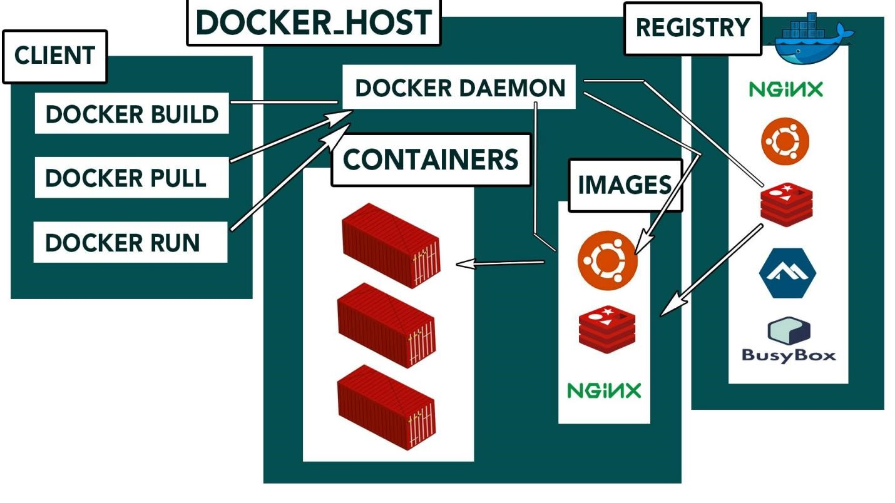

## Docker

- What is a docker?
  - Docker is open source platform that allows developer to build, deploy, run
    ,update and manage containers(Executable components which combines source code with OS libraries and dependencies to run that application)

### Docker architecture
  - Docker uses client-server architecture.
  - The Docker client talks to docker daemon which does building, running and distributing app container.
  - The Docker client and daemon can be on same machine
  - OR can be on remote machines.
  - The Docker client uses REST API to communicate with daemon.
  - The Docker client `(Docker CLI)`
  - The Docker daemon `(Dockerd)`

  #### Docker daemon
  - The Docker daemon `(dockerd)` listens for Docker API requests and manages Docker objects such as:
    - Docker images
    - Docker containers
    - Networks
    - Volumes
  - Also communicates with other daemon to manage docker services.

  #### Docker client
  - The Docker client`(Docker CLI)` used by docker users to communicate with Docker.
  - When Docker user shoot command like `docker build` or `docker run`, the client sends this command to `dockerd`
  - The `docker` uses REST API to send commands.

  #### Docker registry
  - A Docker registry stores docker images.
  - `Docker Hub` is a public registry that anybody can use.
  - By Default, Docker hub is configured as docker registry to look docker images.
  - Some other registries are:
    - Azure, Google, Amazon EC2 container registries
    - Quay.io
    - Binary.io/Artifactory
    - GitHub container registry

### Docker Objects
- Dockerfile
  - Contains command that instruct how to build an image
  - It allows to automate process of container image creation
- Images 
  - Read only template to create container
  - It's group of layers
  - Layer is nothing but result of each instruction in Dockerfile
  - It creates separate layer for each instruction in Dockerfile
  - Layers can be reused. E.g. Downloaded lib can be reused
- Containers 
  - Is runnable instance of an image
  - We can create, delete, move, start, stop container using docker CLI
  - We can create new image using current container state
  - We can attach volume to container
  - Is isolated from other container
  - Is portable(Can be run on any OS)
  - Below image describes difference between container and VMs
  

- Docker volumes
  - Docker volumes preserves data generated by container
  - We can transfer volumes data across containers
  - Its persistent storage of container
        
### Docker core principal
    - Build             ->  From Dockerfile
    - Ship(Pull/Push)   ->  From/To Docker registry
    - Run               ->  On Docker engine
